
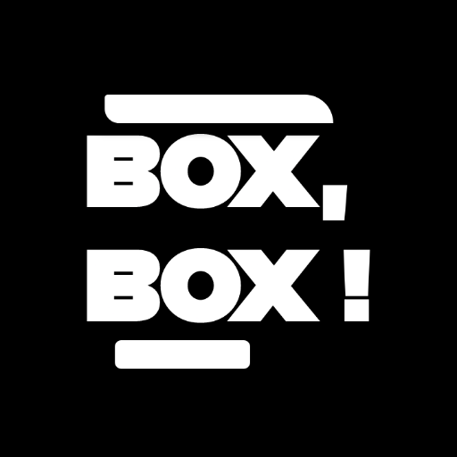</a>
 
<h2 align="center"><b>Box, Box!</b></h2>
<h4 align="center">Unofficial Android and Web app for Formula 1 and Formula E fans!</h4>

## Download

## Screenshots

[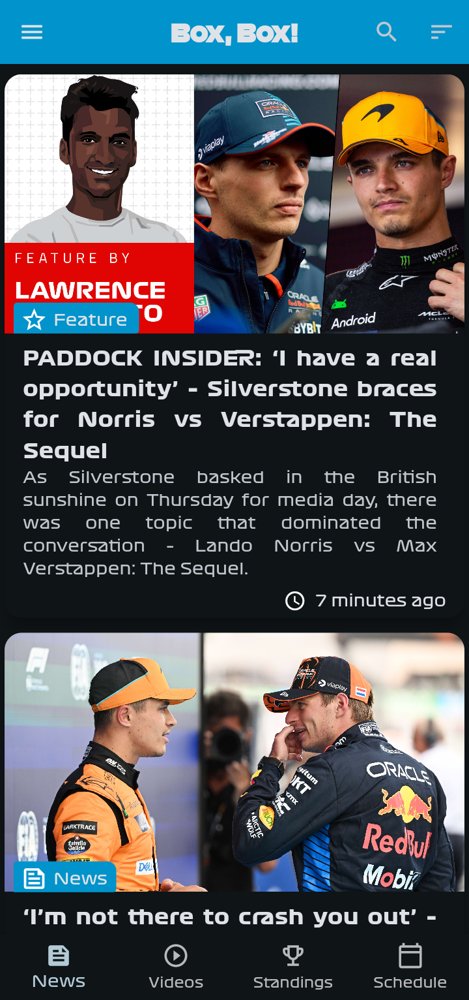](fastlane/metadata/android/en-US/images/phoneScreenshots/0.png)
[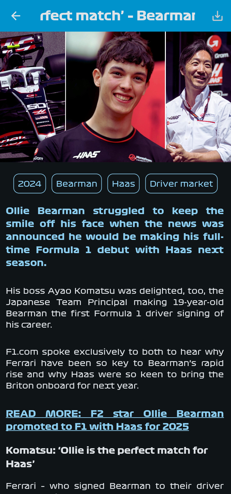](fastlane/metadata/android/en-US/images/phoneScreenshots/1.png)
[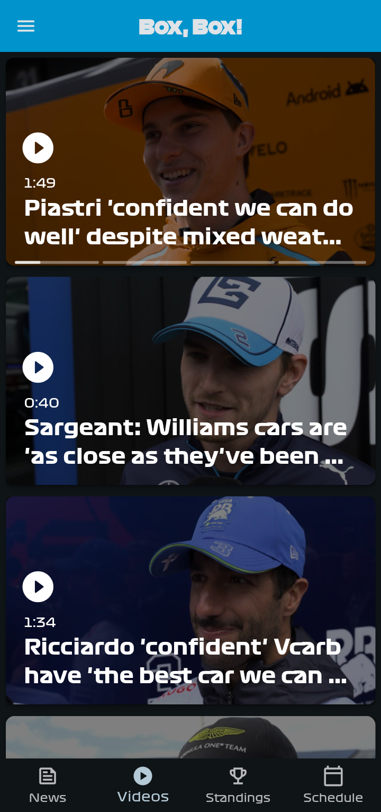](fastlane/metadata/android/en-US/images/phoneScreenshots/2.png)
[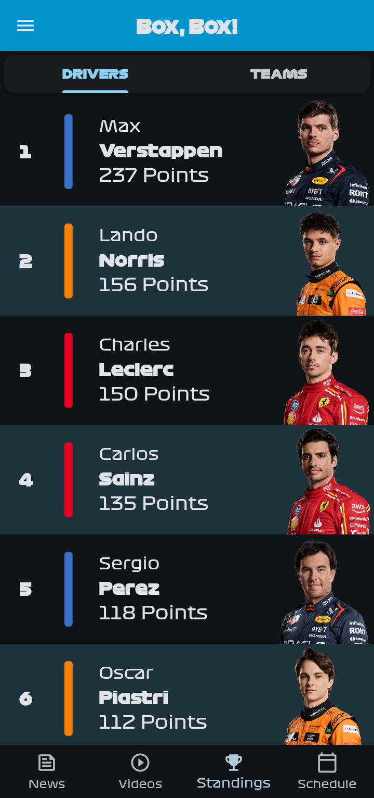](fastlane/metadata/android/en-US/images/phoneScreenshots/3.png)
[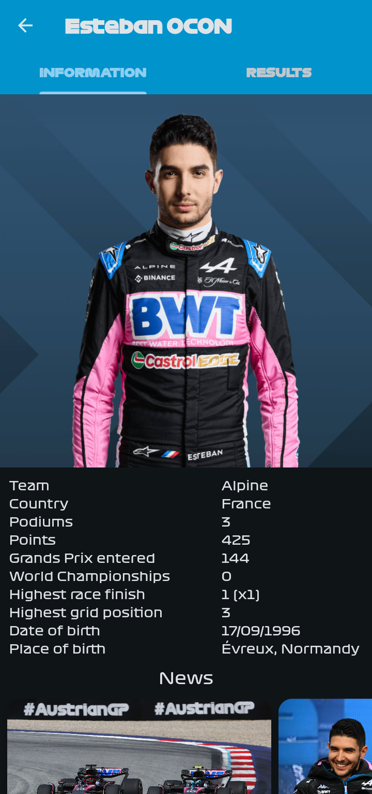](fastlane/metadata/android/en-US/images/phoneScreenshots/4.png)
[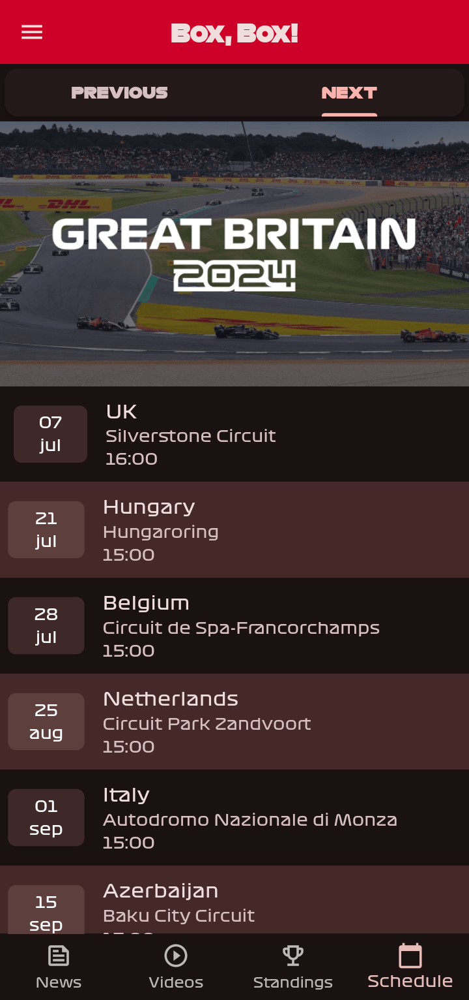](fastlane/metadata/android/en-US/images/phoneScreenshots/5.png)
[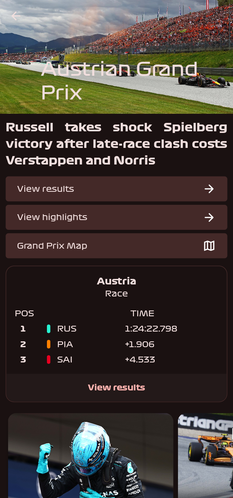](fastlane/metadata/android/en-US/images/phoneScreenshots/6.png)
[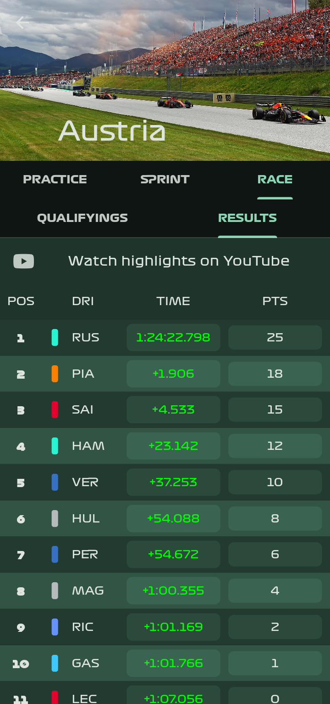](fastlane/metadata/android/en-US/images/phoneScreenshots/7.png)
[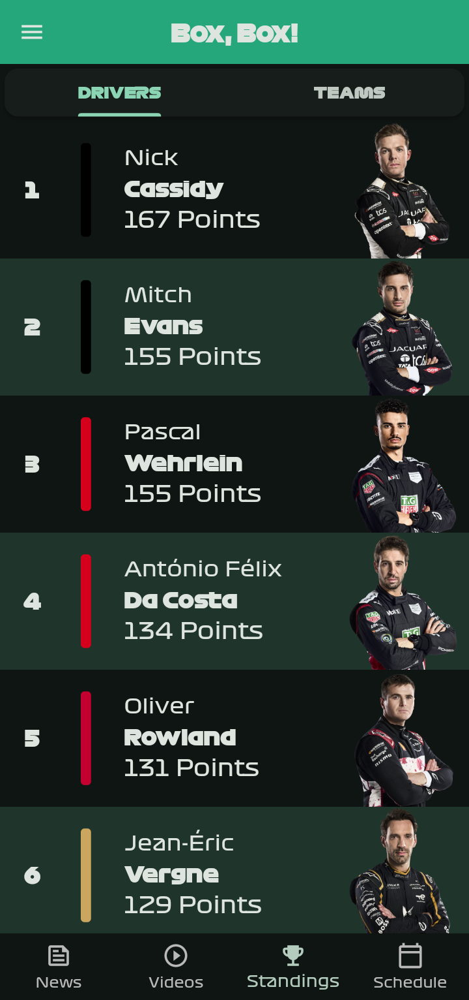](fastlane/metadata/android/en-US/images/phoneScreenshots/7.png)
[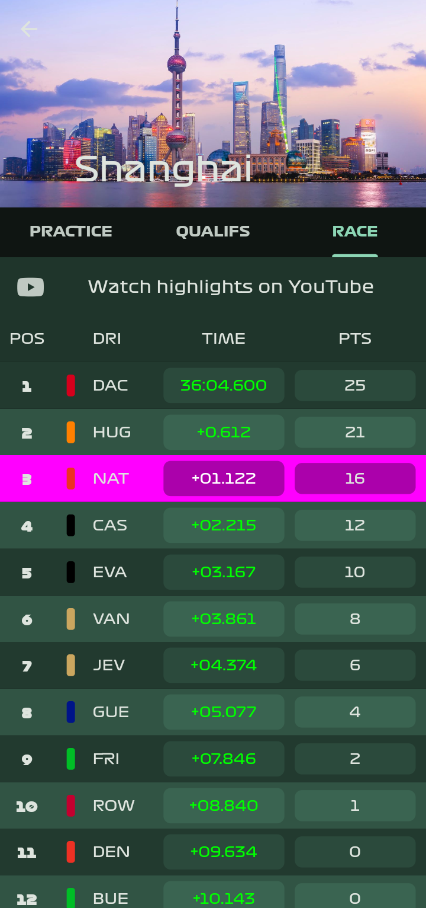](fastlane/metadata/android/en-US/images/phoneScreenshots/7.png)

## Features

- Box, Box! is copylefted libre software, licensed GPLv3+.
- No ads, no trackers or anything else.
- Get the latest stories of your favorite driver and his ranking, even without any Internet connection\*. \
  If you want, you can know where he is born and other personal info (not very useful though)…
- In-app reader for all the editorial articles, with markdown!
- Watch all the latest videos with a dedicated tab and a swipe-up!
- Enjoy the app even at night with dark mode.
- Link to the highlights on YouTube of the qualifications and the race. (or even the sprint…)
- Wait till the next race with a countdown.
- Follow all the action on track with integrated WebView (live leaderboard).
- View the results of all the sessions (free practices, qualifying, sprints and races).
- Enjoy the race hub during a GP!
- Follow both Formula 1 and Formula E from the same app!

\*You need to have Internet connection in order to refresh the data…

### Formula 1

|           Screen           |      Service       |                  URL                   |
| :------------------------: | :----------------: | :------------------------------------: |
|         Home News          |   Formula 1 API    |        https://api.formula1.com        |
|        Home Videos         |   Formula 1 API    |        https://api.formula1.com        |
|      Articles search       |      SearXNG       | [14 instances](lib/api/searx.dart#L26) |
|   Standings (Q, S and R)   |     Ergast API     |         https://ergast.com/mrd         |
| Standings (FP, Q, S and R) | Formula 1 Archives |          https://formula1.com          |
|          Schedule          |     Ergast API     |         https://ergast.com/mrd         |
|        Live Timing         |     Formula 1      |          https://formula1.com          |

### Formula E

Everything comes from the same API (Formula E API): https://api.formula-e.pulselive.com.

